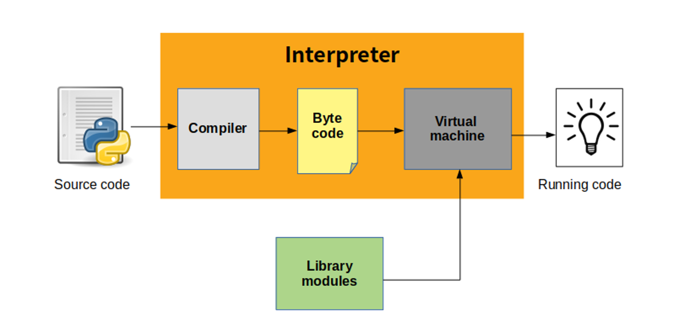
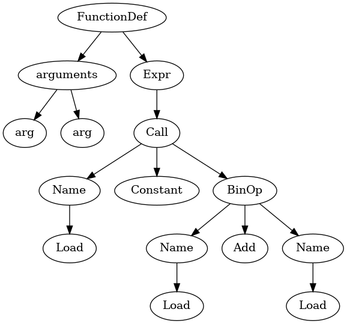
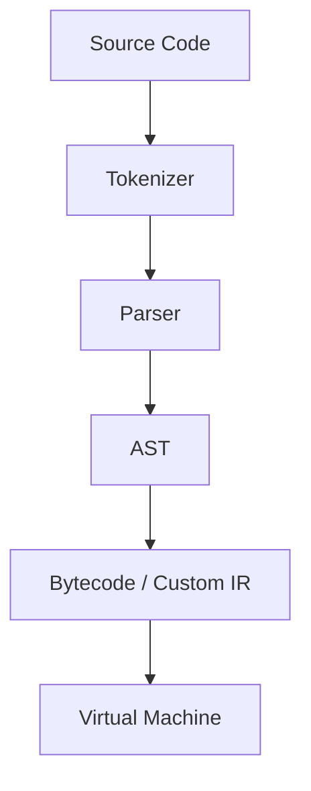
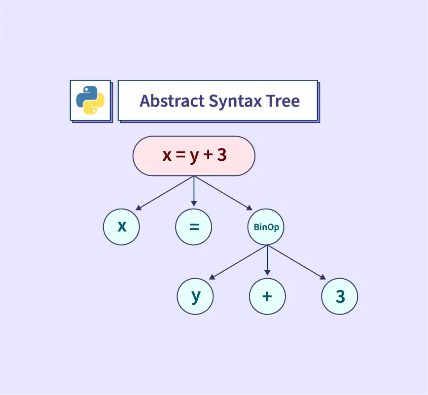
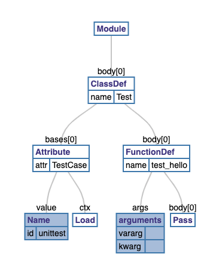
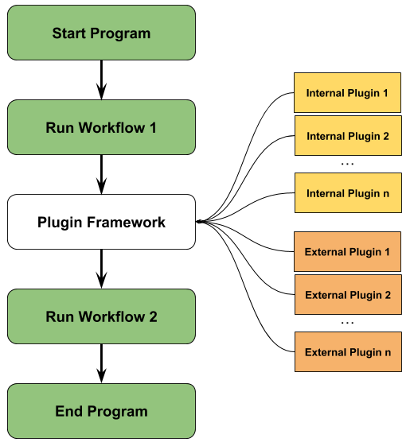
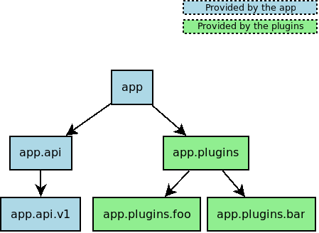
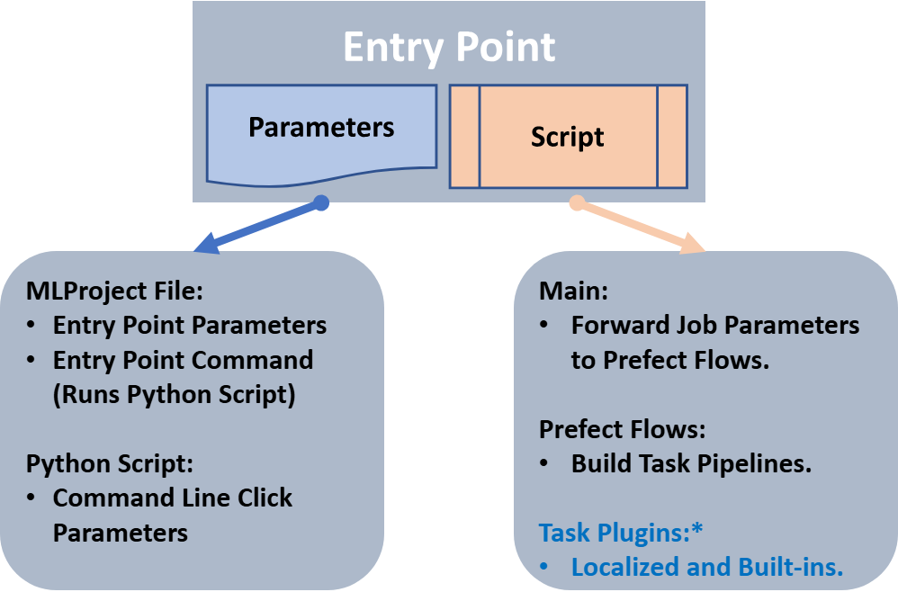
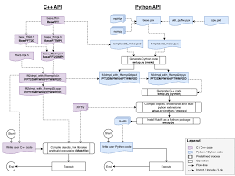

# 1️⃣ Custom Interpreter (Meta-Programming Level)

<p align="center" style="display: flex; justify-content: center;">
  
  
  
</p>

## 🎯 Maqsad

Python kodini:
*   o‘zingizcha o‘qish
*   tahlil qilish
*   boshqacha bajarish

> Bu — Python’ni Python bilan yozish darajasi.

## 🧠 Asosiy pipeline (REAL)


*CPython ham shunaqa ishlaydi, faqat C’da yozilgan.*

### Minimal custom interpreter g‘oyasi

```python
class Interpreter:
    def eval(self, node):
        if node["type"] == "number":
            return node["value"]
        if node["type"] == "add":
            return self.eval(node["left"]) + self.eval(node["right"])
```

👉 **Bu expression language.**

> [!NOTE] 
> **Advanced Note 🧠**
>
> *   Django ORM expressions
> *   SQLAlchemy Core
> *   Pydantic validation engine
>
> 👉 hammasi interpreter + AST logika

### Qachon kerak?

*   DSL (domain-specific language)
*   Rule engine
*   Config language
*   Security sandbox (restricted python)

---

# 2️⃣ AST Manipulation (Python Code Generator)

<p align="center" style="display: flex; justify-content: center;">
  
  
  
</p>

## 🎯 Maqsad

Python kodini:
*   o‘qish
*   o‘zgartirish
*   qayta yozish

👉 **eval() emas. Bu compiler-level ish.**

### AST nima?

```python
x = a + b
```

Bu aslida:

```python
BinOp(
  left=Name('a'),
  op=Add(),
  right=Name('b')
)
```

### AST bilan ishlash

```python
import ast

tree = ast.parse("x = a + b")
ast.dump(tree, indent=2)
```

### Code transform misoli

```python
class AddLogger(ast.NodeTransformer):
    def visit_FunctionDef(self, node):
        node.body.insert(0, ast.parse("print('called')").body[0])
        return node
```

👉 **Funksiya ichiga avtomatik logger qo‘shadi.**

> [!NOTE]
> **Advanced Note 🧠**
>
> AST ishlatiladi:
> *   linters (flake8, pylint)
> *   formatters (black)
> *   ORMs
> *   serializers
> *   test auto-generation
> *   security scanners

> [!WARNING]
> **🚨 Muhim xavf**
>
> *   AST noto‘g‘ri bo‘lsa → segfault darajasida bug
> *   Har doim `ast.fix_missing_locations()` ishlating

---

# 3️⃣ Plugin System Architecture (Extensible Python)

<p align="center" style="display: flex; justify-content: center;">
  
  
  
</p>

## 🎯 Maqsad

Ilovani:
*   core + plugins
*   runtime’da kengaytirish

👉 **Django apps, pytest plugins, airflow operators — hammasi shu.**

## 3 ta real yondashuv

### 🅰️ Registry Pattern (Simple & Clean)

```python
PLUGINS = {}

def register(name):
    def wrapper(cls):
        PLUGINS[name] = cls
        return cls
    return wrapper
```

### 🅱️ Dynamic Import (Medium)

```python
import importlib

module = importlib.import_module("plugins.auth_google")
```

### 🅲 Entry Points (Production level)

`pyproject.toml` yoki `setup.py`:
```toml
[project.entry-points."myapp.plugins"]
auth = "auth_plugin:AuthPlugin"
```

Python code:
```python
from importlib.metadata import entry_points
entry_points(group="myapp.plugins")
```

> [!NOTE]
> **Advanced Note 🧠**
>
> Entry points:
> *   virtualenv isolation
> *   pip orqali install
> *   runtime discovery
>
> 👉 **Enterprise-level plugin systems**

### Qachon plugin kerak?

*   Payment gateways
*   Auth providers
*   Report generators
*   ML pipelines

---

# 4️⃣ Python C API (Hardcore Level)

<p align="center" style="display: flex; justify-content: center;">
  
  
</p>

## 🎯 Maqsad

Python’ni:
*   tezlashtirish
*   C/C++ bilan kengaytirish
*   OS-level API bilan bog‘lash

### Minimal C extension

```c
#include <Python.h>

static PyObject* add(PyObject* self, PyObject* args) {
    int a, b;
    PyArg_ParseTuple(args, "ii", &a, &b);
    return PyLong_FromLong(a + b);
}
```

### Setup.py

```python
from setuptools import Extension, setup

setup(
    ext_modules=[Extension("fastmath", ["fastmath.c"])]
)
```

> [!NOTE]
> **Advanced Note 🧠**
>
> Python C API ishlatiladi:
> *   numpy
> *   pandas
> *   psycopg2
> *   uvloop
> *   pillow

> [!CAUTION]
> **🚨 Xavf zonasi**
>
> *   Reference counting xatolari → **crash**
> *   GIL noto‘g‘ri boshqarish → **deadlock**
> *   Memory leak → **process kill**

### Alternative (Safer)

*   Cython
*   PyO3 (Rust)
*   CFFI

---

# 🧠 BIG PICTURE (Advanced Insight)

| Mavzu | Sizga nima beradi |
| :--- | :--- |
| **Custom Interpreter** | DSL, rule engine |
| **AST** | Code generation, tooling |
| **Plugin System** | Extensible architecture |
| **Python C API** | Performance & native power |

## 🚀 Learning Strategy (Tavsiya)

1.  **AST** → boshlash uchun eng to‘g‘ri
2.  **Plugin system** → real product architecture
3.  **Interpreter** → tilni tushunish
4.  **C API** → performance wall urilganda
